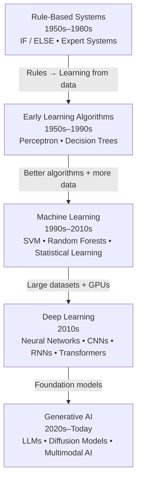

## Data

> Any information that can be collected, stored, and analyzed

In practice, we often separate tabular and non-tabular data.

=== "Tabular"

    ==Can fit into a table or a spreadsheet==

    - **Numerical**: prices, temperatures, revenue, sensor measurements, ages, time-spent, number of click, etc.
    - **Categorical**: country, product category, customer type, yes/no values, etc.
    - **Time-series**: stock prices, website traffic, heart-rate measurements, IoT readings over time.
    - **Graph/network**: social connections, relationships between companies, transportation networks.
    - **Location/spatial**: GPS coordinates, maps, geographic regions.

=== "Non-tabular"

    ==Everything else==

    - **Text**: emails, reviews, documents, social-media posts, support conversations.
    - **Images**: photographs, medical scans, satellite imagery, handwritten digits.
    - **Audio**: speech recordings, music, environmental sounds.
    - **Video**: surveillance footage, sports recordings, driving footage.

## Big data

**Big data** describes data whose scale, speed, diversity, or complexity creates challenges for traditional tools and processes. A common way to remember the challenges is the "3 Vs" (sometimes 5):

| V            | Meaning                              | Luma example                                    |
| ------------ | ------------------------------------ | ----------------------------------------------- |
| **Volume**   | A lot of records                     | Millions of website events                      |
| **Velocity** | Data arrives quickly or continuously | Live clicks during a product launch             |
| **Variety**  | Many formats and sources             | Tables, reviews, images, video, and sensor data |

Big data is not automatically valuable. A large dataset can still be irrelevant, biased, badly collected, or impossible to interpret.

## Smart data

**Smart data** is a practical label for data that has been selected, prepared, contextualised, and governed so that it can support a specific decision. It is not necessarily large.

For a campaign, a small table containing recent, consented, relevant customer segments may be more useful than billions of unfiltered social-media events. Smart data should be:

- relevant to the question
- understandable, with clear definitions and units
- timely enough for the decision
- checked for quality and bias
- collected and used lawfully
- connected to an action or decision.

## Open data

**Open data** is data that people can access, use, and share under stated conditions, usually through an open licence. "Open" does not mean "anything is allowed": a licence can require attribution, prohibit certain uses, or specify how the data can be shared.

!!! tip "Open data in France"

    In France, a lot of the data is made public via the [datagouv platform](https://www.data.gouv.fr/). There is a lot of things you can find: businesses and economy, real estate and urban planning, geography and addresses, transport and mobility, energy and environment, health, education, employment and population, agriculture and food, public administration and finance, elections and public life, culture, security.

## Data in AI VS AI

What we call "AI" often means generative AI, but AI is much more than that.

<center>
    


</center>

Today, most people doing data analytics aren't doing AI, but all AI researchers/engineers are working with data.

The rise of Gen AI has been possible mostly **because of compute availabilities**:


We're now using extremely high amount of compute, and even more each year:


## Going further:

- [Video, FR] [How does ChatGPT run on a single database server](https://www.youtube.com/watch?v=Awu5RoPmy-0)
- [Blog, EN] [Big data doesn't exist](https://techcrunch.com/2015/09/10/big-data-doesnt-exist/)
```
